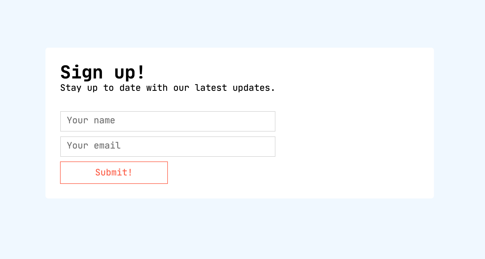

# feedback_form

You need to create a `config.py` file in the main folder.

Here is the configuration variables you need to connect with mailtrap.io :

- MAIL_SERVER = 'smtp.mailtrap.io'
- MAIL_PORT = 2525
- MAIL_USERNAME = Your username
- MAIL_PASSWORD = Your password
- MAIL_USE_TLS = True
- MAIL_USE_SSL = False

